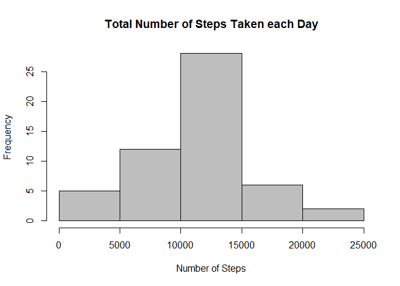
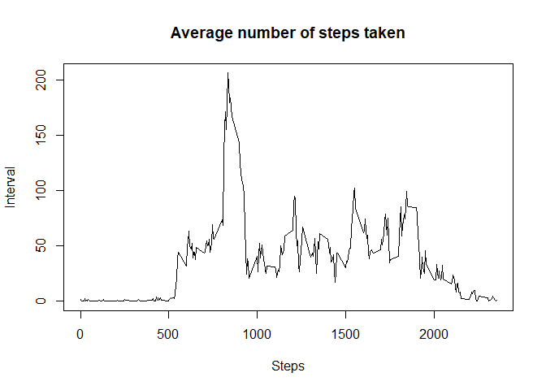
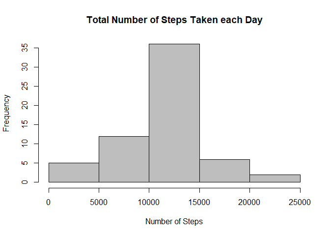
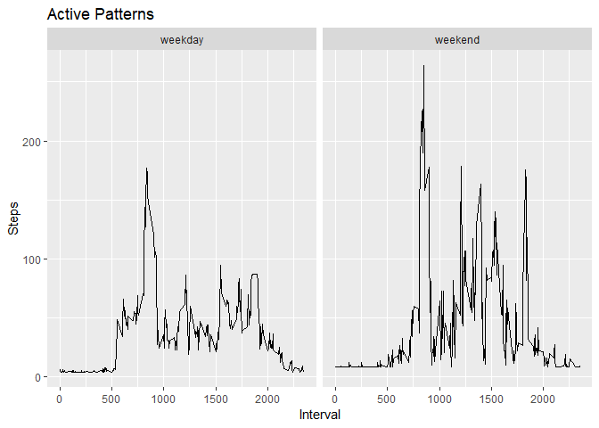

## 1. Loading and preprocessing the data


```r
activities <- read.csv("activity.csv")
str(activities)
```

```
## 'data.frame':	17568 obs. of  3 variables:
##  $ steps   : int  NA NA NA NA NA NA NA NA NA NA ...
##  $ date    : Factor w/ 61 levels "2012-10-01","2012-10-02",..: 1 1 1 1 1 1 1 1 1 1 ...
##  $ interval: int  0 5 10 15 20 25 30 35 40 45 ...
```

```r
## Convert date column from Factor to Character
activities$date <- as.character(activities$date)
str(activities)
```

```
## 'data.frame':	17568 obs. of  3 variables:
##  $ steps   : int  NA NA NA NA NA NA NA NA NA NA ...
##  $ date    : chr  "2012-10-01" "2012-10-01" "2012-10-01" "2012-10-01" ...
##  $ interval: int  0 5 10 15 20 25 30 35 40 45 ...
```

```r
summary(activities)
```

```
##      steps            date              interval     
##  Min.   :  0.00   Length:17568       Min.   :   0.0  
##  1st Qu.:  0.00   Class :character   1st Qu.: 588.8  
##  Median :  0.00   Mode  :character   Median :1177.5  
##  Mean   : 37.38                      Mean   :1177.5  
##  3rd Qu.: 12.00                      3rd Qu.:1766.2  
##  Max.   :806.00                      Max.   :2355.0  
##  NA's   :2304
```

## 2. Histogram of the total number of steps taken each day

```r
grpActivities <- group_by(activities, date)
grpActivities <- summarize(grpActivities, sum(steps))
colnames(grpActivities) <- c("date","steps")
hist(grpActivities$steps, xlab="Number of Steps", main="Total Number of Steps Taken each Day", col="gray")
```

<!-- -->

## 3. Mean and median number of steps taken each day

```r
mean(grpActivities$steps, na.rm=TRUE)
```

```
## [1] 10766.19
```

```r
median(grpActivities$steps, na.rm=TRUE)
```

```
## [1] 10765
```

## 4. Time series plot of the average number of steps taken

```r
grpActivities <- group_by(activities, interval)
grpActivities <- summarize(grpActivities, mean(steps, na.rm=TRUE))
colnames(grpActivities) <- c("interval","steps")
plot(grpActivities$interval, grpActivities$steps, main="Average number of steps taken", xlab="Steps", ylab="Interval", type="l")
```

<!-- -->

## 5. The 5-minute interval that, on average, contains the maximum number of steps

```r
intervalWithMaxSteps <- filter(grpActivities, steps==max(steps))
str(intervalWithMaxSteps)
```

```
## Classes 'tbl_df', 'tbl' and 'data.frame':	1 obs. of  2 variables:
##  $ interval: int 835
##  $ steps   : num 206
```

## 6. Imputing missing values

### 6.1 Total number of missing values in the dataset 

```r
sum(is.na(activities$steps))
```

```
## [1] 2304
```

### 6.2 Strategy for filling in all of the missing values in the dataset

```r
activitiesNoMissingValues <- activities
meanSteps <- mean(activitiesNoMissingValues$steps, na.rm=TRUE)
```

### 6.3 New dataset that is equal to the original dataset but with the missing data filled in

```r
activitiesNoMissingValues[is.na(activitiesNoMissingValues$steps), "steps"] <- meanSteps
```

## 7. Histogram of the total number of steps taken each day after missing values are imputed

```r
grpActivities <- group_by(activitiesNoMissingValues, date)
grpActivities <- summarize(grpActivities, sum(steps))
colnames(grpActivities) <- c("date","steps")
hist(grpActivities$steps, xlab="Number of Steps", main="Total Number of Steps Taken each Day", col="gray")
```

<!-- -->

## 8. Mean and median number of steps taken each day after missing values are imputed

```r
mean(grpActivities$steps)
```

```
## [1] 10766.19
```

```r
median(grpActivities$steps)
```

```
## [1] 10766.19
```


## 9. Panel plot comparing the average number of steps taken per 5-minute interval across weekdays and weekends

```r
activitiesNoMissingValues$date <- as.Date(activitiesNoMissingValues$date, '%Y-%m-%d')
activitiesNoMissingValues$wday <- ifelse(wday(activitiesNoMissingValues$date) %in% c(0, 6), "weekend", "weekday") 
grpActivities <- group_by(activitiesNoMissingValues, interval, wday)
grpActivities  <- summarize(grpActivities, mean(steps))
colnames(grpActivities) <- c('interval', 'wday', 'steps')
 
g<-ggplot(grpActivities, aes(interval, steps, fill=wday))
g+geom_line()+facet_grid(.~wday)+xlab("Interval")+ylab("Steps")+ggtitle("Active Patterns")
```

<!-- -->
